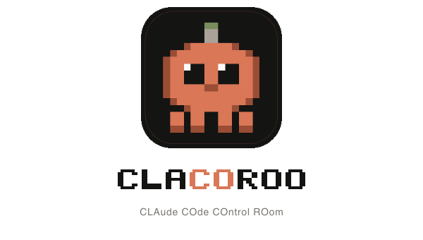

<div align="center">



**Visual control panel for [Claude Code](https://github.com/anthropics/claude-code)**
Manage plugins, marketplaces, skills, agents, MCP servers, hooks, stats, quotas and API keys with a native desktop UI — no CLI commands to memorize.

[](https://www.electronjs.org/)
[](#requirements)
[](LICENSE)
[](CHANGELOG.md)

**💛 Support the project:**
[](https://github.com/sponsors/Maxymize)
[](https://buymeacoffee.com/maxymize)
[](https://paypal.me/maxymizebusiness)

🇬🇧 · [🇮🇹](README.it.md)

</div>

---

## What is CLACOROO

**CLA**ude **CO**de **CO**ntrol **ROO**m is an Electron desktop app that puts a graphical UI on top of every configuration file Claude Code reads from `~/.claude/`. The orange `CO` in the wordmark overlaps between **Co**de and **Co**ntrol — a small visual pun for what it does: a regia booth for Claude Code, mascotted by **CLACOROO**, a pixel-art 4-legged creature with a green LED antenna (Anthropic Green) glowing on top.

Before CLACOROO, managing Claude Code plugins, marketplaces, skills, agents, MCP servers, hooks and configuration required:
- Memorizing and typing CLI commands `claude plugins enable/disable/install/update ...`
- Hand-editing JSON files scattered across `~/.claude/`
- Opening Claude Code interactive TUI to check quotas, account, usage

CLACOROO does all this in clicks within a single native desktop app, with live observability, while keeping full security of the original OAuth credentials (never overwritten).

## Key features

### 🏠 Dashboard
At-a-glance view of what matters:
- Context estimation: skills (frontmatter index) · system prompt · agents · memory files · MCP servers · free space, against the 200K token window
- Live Claude quotas: Session (5h) / Weekly (7d) / Weekly Sonnet bars with percentage and reset time
- 9 installation KPIs (enabled/disabled plugins, marketplaces, skills, agents, MCP connected, health issues, always-on tokens)
- 9 Claude Code usage KPIs (sessions, messages, total tokens, estimated API value in USD, active days, streak, peak hour, preferred model)

### 🏪 Marketplaces
- List of registered marketplaces with `X/Y installed` count for each
- Expandable cards with "Marketplace plugins" modal showing every plugin (installed or available)
- **Add Marketplace** from the panel: source input (GitHub shorthand `user/repo` · git URL · local path)
- **Install Plugin** directly from the marketplace modal with token cost preview
- Update/remove marketplace · 5 sort modes (recently added, recently updated, etc.)

### 🧩 Plugins
- Single toggle enable/disable · update · uninstall
- Full-text search with filters by status and marketplace
- "Plugin content" modal: header with id/marketplace/version, numeric summary (skills/agents/MCP/hooks/tok), clickable list of skills and agents, detailed hook events (with matcher/handler count), "Open in Finder" and "Open in editor" buttons (VS Code · Cursor · Antigravity · System)
- Scope badge `global` (blue) / `local: project-name` (green) — multi-project support

### ⚡ Skills · 🤖 Agents
- Searchable browser for all skills and agents (global + tracked projects)
- Click a skill opens inline markdown viewer (DOM-based, no innerHTML)
- ⚠ "Health issue" badge on skills/agents with missing or malformed frontmatter

### 🛠 MCP Servers
- List all configured MCP servers with Connected / Needs Auth / Error status
- Marketplace-style cards for each server with transport (HTTP / stdio / SSE), URL/command, origin
- Filters by status and type (claude.ai global / from plugins)
- "Refresh live status" button re-runs official Claude Code health check
- "MCP connected" KPI in Dashboard (X/Y connected)

### 📊 Stats
- Overview tab: 8 KPIs + Claude Desktop-style heatmap (52 weeks × 7 days)
- Models tab: token bars per model (input/output/cache) + daily histogram with per-model tooltip
- Per-project tab: project list with sessions, messages, aggregated tokens + KPI-style design
- Filters All / 30d / 7d for all KPIs (aligned with `claude /stats`)

### ⚙ Standalone Config
- Visual editor for `~/.claude/settings.json`: model, theme (including dark-daltonized/light-ansi), response language, Always Thinking, Voice (nested `voice.enabled` field), Effort 5-dots slider (low → max)
- Instant updates + live reload settings from filesystem watcher

### 🔐 Claude Account + API key
- Account panel with plan badge (Max / Pro / Team), email, organization, org ID, auth method, API provider
- Live status badge: 🟢 Connected / 🔴 Disconnected (when OAuth token expires and refresh fails 401/403)
- **"↗ Terminal login"** button appears automatically when auth is broken — opens the integrated CLACOROO terminal and runs `claude auth login`
- Cross-platform session/weekly quotas (macOS Keychain / Linux file fallback / Windows file fallback)
- Dedicated **Claude API key** (alternative to OAuth subscription): input + connection test + cross-platform encrypted storage (macOS Keychain · Linux libsecret/file 600 · Windows DPAPI) + official `apiKeyHelper` integration with Claude Code via chmod 700 helper script + `settings.json` write

### 📟 Integrated Terminal (Pack B v1.0.67+)
- Multi-tab bottom drawer (xterm.js + node-pty)
- Status dot per tab: 🟢 idle / 🟠 busy / 🔴 dead (based on onData activity)
- Tab label = short cwd (`~`, `~/Dev`, `~/…/clacoroo`) with 3s live polling (lsof on macOS, `/proc/<pid>/cwd` on Linux)
- Tab persistence across restarts (drawer height + tab list with saved cwd)
- Shortcuts: `Cmd+\`` toggle drawer · `Cmd+T` new tab
- CLACOROO theme: orange cursor, bg `#0d0c0b`, Anthropic palette for ANSI colors

### ⚡ Soft auto-update
- Check at startup + every 24h via GitHub Releases API
- Sidebar footer: 🟢 green dot / 🟠 orange dot + inline "UPDATE" button
- Sticky topbar banner "New version X.Y.Z available"
- Click → opens release page in browser, no in-app download/install (silent updates require Apple Developer ID + notarization)

### 🎨 UX polish
- Global command palette `Cmd+K` (fuzzy search plugin/skill/agent/marketplace/actions)
- "Recents" sidebar with latest activity timeline
- Always-visible account pill in sidebar (plan badge + email)
- macOS native notifications on plugin actions (only when app is not in focus)
- In-app changelog viewer with category color badges (FEATURE/FIX/IMPROVEMENT/SECURITY/REFACTOR/DOCS/CHORE)
- UI auto-refresh when `~/.claude/` files change externally (`fs.watchFile`)

## Auto-refresh
The UI updates itself when Claude Code config files change (`fs.watchFile` cross-platform), no manual restart required.

## Requirements

- **Node.js** 18+ and **npm** — [nodejs.org](https://nodejs.org)
- **Claude Code** CLI installed and reachable (`claude` in `PATH`) — [Claude Code installation](https://docs.anthropic.com/claude-code)

## Installation

### From pre-built release (macOS)

Go to [Releases](https://github.com/Maxymize/clacoroo/releases) and download:
- `CLACOROO-X.Y.Z-arm64.dmg` for Apple Silicon Mac (M1/M2/M3/M4)
- `CLACOROO-X.Y.Z-x64.dmg` for Intel Mac

Open the `.dmg`, drag CLACOROO into your Applications folder.

> **macOS Gatekeeper** — the binary is ad-hoc signed (without Apple Developer ID notarization, see Pack E in [TASK.md](TASK.md)). The first time you open it, macOS will ask **"Are you sure you want to open this app downloaded from the Internet?"** → click **Open**. No Terminal commands required.
>
> If you instead see **"CLACOROO is damaged and can't be opened"** (rare, happens if the DMG itself was flagged by your browser's quarantine), run this single command in Terminal before opening:
> ```bash
> xattr -cr ~/Downloads/CLACOROO-*-arm64.dmg
> ```
> Then re-open the DMG and proceed normally.

### From source (all platforms)

```bash
git clone https://github.com/Maxymize/clacoroo.git
cd clacoroo
npm install
npm start
```

To generate distributable packages:

```bash
# macOS .dmg (arm64 + x64) — requires librsvg via brew + dmgbuild via pip
npm run build

# Windows .exe (NSIS + portable) — requires Win toolchain or build from Windows
npm run build:win

# Linux .AppImage + .deb + .rpm — requires build from Linux for node-pty rebuild
npm run build:linux
```

Output is generated in `dist/`.

## How it works

CLACOROO auto-detects Claude Code's config directory:

| OS | Path |
|---|---|
| macOS / Linux | `~/.claude/` |
| Windows | `%APPDATA%\Claude\` |

**Read** (directly from filesystem):
- `installed_plugins.json` — installed plugins (v2 format with `"plugin@marketplace"` keys)
- `blocklist.json` — disabled plugins
- `known_marketplaces.json` — registered marketplaces
- `settings.json` — configuration (model, theme, voice, language, enabled plugins)
- `cache/` — plugin sources with skills (subdirectories) and agents (`.md` files)
- `stats-cache.json` — heatmap, tokens per model, total sessions, streak
- `projects/<proj>/<session>.jsonl` — per-turn usage (input/output/cache tokens)

**Write** (never directly to plugin JSONs, always via CLI):
- `claude plugins enable|disable|uninstall|update <id>`
- `claude plugins marketplace add|remove|update <name>`
- `claude plugins install <plugin>@<marketplace>`

`settings.json` is modified directly (safe operation, atomic write + filesystem watcher for re-sync).

Works fully offline after install. All data is local. CLACOROO **never overwrites** Claude Code's Keychain (it reads OAuth credentials for quotas, but doesn't modify them).

## Architecture

```
src/
├── main.js              ← Electron main process: I/O, IPC, CLI, fs.watch
├── preload.js           ← Secure contextBridge → window.claudeAPI
├── lib/
│   ├── account.js       ← Claude account info via `claude auth status --json`
│   ├── apikey.js        ← API key encrypted storage cross-platform (Keychain/libsecret/DPAPI)
│   ├── changelog.js     ← Synthetic parser with badge categories
│   ├── markdown.js      ← Markdown → DOM (no innerHTML)
│   ├── mcp.js           ← MCP server health check
│   ├── menu.js          ← Native macOS application menu
│   ├── pricing.js       ← API value estimation in USD (Anthropic public prices)
│   ├── pty.js           ← Pseudo-terminal manager (node-pty)
│   ├── snapshot.js      ← Export/import .clacoroo snapshot
│   ├── state.js         ← state.json + activity log persistence
│   ├── stats.js         ← Token aggregation, heatmap, per-project
│   ├── updater.js       ← Soft auto-update via GitHub Releases API
│   └── usage.js         ← OAuth quotas + token refresh
└── renderer/
    ├── index.html       ← SPA shell (sidebar + content)
    ├── style.css        ← CLACOROO design system
    ├── app.js           ← SPA logic: state → loadData → render
    ├── clacoroo.svg     ← Pixel-art mascot (just <rect>)
    ├── clacoroo-blink.svg ← Blink variant (animation)
    ├── fonts/           ← Inter + Source Serif 4 + Press Start 2P (self-hosted)
    ├── lib/
    │   └── term.js      ← xterm.js wrapper for drawer tabs
    └── vendor/
        └── xterm/       ← xterm.js + 2 addons vendored (no CDN)
```

Full technical handoff doc: [`docs/doc-tecnico_handoff.html`](docs/doc-tecnico_handoff.html).

## Security

CLACOROO follows modern Electron best practices:

- ✅ `contextBridge` with `contextIsolation: true`, `nodeIntegration: false`, `sandbox: true`
- ✅ All CLI calls use `execFile` with argument arrays (zero shell injection risk)
- ✅ Plugin IDs, marketplace names, source URLs validated with regex before any call
- ✅ DOM construction with `createElement` + `textContent`, never `innerHTML` with dynamic data
- ✅ Strict CSP: `default-src 'self'`, `script-src 'self'`, `style-src 'self' 'unsafe-inline'`, `font-src 'self'`, `img-src 'self' data:` — no remote CDN
- ✅ Claude API key (pay-per-use mode): cross-platform encrypted storage (macOS Keychain · Linux libsecret · Windows DPAPI), key never logged or shown in plain text in the renderer, helper script chmod 700, dedicated Keychain service `com.maxymize.clacoroo.apikey` (separated from Claude Code's)
- ✅ Soft auto-update: reads GitHub Releases API, no auto-install (silent updates require signing)
- ✅ Single-instance lock + `setWindowOpenHandler` blocks popups + `will-navigate` blocks external navigation
- ✅ Runtime dependencies minimized: just `node-pty` (terminal) + `@xterm/xterm` & 2 addons (renderer)

## Brand

CLACOROO uses a palette inspired by Claude (Anthropic) but distinct:

| Token | Hex | Use |
|---|---|---|
| Claude Orange | `#d97757` | Primary accent, brand mark, CTA |
| Claude Dark | `#141413` | Main background |
| Surface | `#1e1c1a` | Card, sidebar |
| Cream | `#faf9f5` | Primary text |
| Anthropic Green | `#788c5d` | Mascot LED, success status |
| Anthropic Blue | `#6a9bcc` | Secondary accent |

The CLACOROO mascot is drawn entirely with SVG `<rect>` (zero path / zero curves), retro pixel-art like Clawd but with a green LED antenna "control room online" that sets it apart.

Self-hosted fonts (SIL OFL):
- **Inter** — UI, brand, KPIs
- **Source Serif 4** — markdown body
- **Press Start 2P** — CLACOROO wordmark (sidebar + DMG installer)

## Tech stack

**Electron 36** · **Vanilla JS** (no framework) · **Node.js 18+** · `contextBridge` + `contextIsolation` · `execFile` (no shell) · `fs.watchFile` for auto-refresh · **node-pty** + **@xterm/xterm** for integrated terminal · **dmgbuild** (Python) for DMG installer · **electron-builder** for packaging

## Roadmap

See [`TASK.md`](TASK.md) for the full plan.

In progress:
- **Pack B** extensions — Inline skill launcher (▶ button on each skill runs `claude -p "<skill>"` in the terminal)
- **Pack C** — Insights + analytics (token cost per plugin, top-N chart, dependency tree)
- **Pack D** — Light theme + UI language switch
- **Pack E** — Full-auto distribution (Apple Developer ID, notarization, electron-updater, multi-OS CI/CD)

## Contributing

Commit convention: message prefixed with version, e.g. `v1.0.72 — description`.
Versioning: only the last digit `1.0.xx` (see [`CLAUDE.md`](CLAUDE.md) for full rules).

## License

**GNU Affero General Public License v3.0 or later (AGPL-3.0-or-later)**

Copyright © 2026 **MAXYMIZE** (Maximilian Giurastante &lt;info@maxymizebusiness.com&gt;)

CLACOROO is free software: you can redistribute it and/or modify it under the terms of the GNU Affero General Public License as published by the Free Software Foundation, either version 3 of the License, or (at your option) any later version.

CLACOROO is distributed in the hope that it will be useful, but WITHOUT ANY WARRANTY; without even the implied warranty of MERCHANTABILITY or FITNESS FOR A PARTICULAR PURPOSE. See the GNU Affero General Public License for more details — full text in [`LICENSE`](LICENSE) or at [gnu.org/licenses/agpl-3.0](https://www.gnu.org/licenses/agpl-3.0).

### What AGPL-3.0 means in practice

- ✅ **You can** use, copy, modify and redistribute it for free
- ✅ **You can** use it in personal and internal commercial projects
- ⚠️ **You must** release any derivative work you distribute under the same license
- ⚠️ **You must** make the source code available if you offer CLACOROO (or a derivative) as a network service accessible to third parties
- ❌ **You cannot** turn it into a closed SaaS product without redistributing the modified code

For commercial use that cannot meet AGPL terms, a separate commercial license is available on request: write to `info@maxymizebusiness.com`.

---

## ☕ Support the project

If CLACOROO is useful in your daily workflow, consider supporting its continued development. Pick the channel you prefer — they all fund the same project:

[](https://github.com/sponsors/Maxymize)
[](https://buymeacoffee.com/maxymize)
[](https://paypal.me/maxymizebusiness)

### Which channel should you choose?

| Channel | Best for | Notes |
|---|---|---|
| 💖 **GitHub Sponsors** | Developers active on GitHub, recurring monthly support | 0% fee, GitHub matches donations 1:1 during the first 12 months |
| ☕ **Buy Me a Coffee** | One-time micro-donations, community/creator audience | Familiar "buy a coffee" UX, supports recurring memberships too |
| 💳 **PayPal** | Traditional / Italian users, businesses, anyone with an existing PayPal account | No new account to create, instant transfer |

### What donations fund

- 🍎 Apple Developer Program subscription (signed binaries + Mac App Store version)
- 🛠 Continued development, bug fixes and feature releases
- 📡 Infrastructure (GitHub Releases, hosting, future cloud sync)
- 💛 Time spent supporting the community (issues, PR review, Discord)

CLACOROO **is and always will be free and open source** (AGPL-3.0). Donations are entirely voluntary and don't unlock any extra feature — that's the real spirit of free software.

---

## Disclaimer

CLACOROO is an **independent third-party tool** and is **not affiliated with, endorsed by, or sponsored by Anthropic, PBC**. It is an autonomous project developed and maintained by **MAXYMIZE** with the sole purpose of making it easier to use the official [Claude Code](https://github.com/anthropics/claude-code) CLI through a graphical interface. "Claude" and "Anthropic" are trademarks of Anthropic, PBC. CLACOROO uses Claude Code's own configuration files and CLI commands without modifying them.
